# MallProject
基于DRF+Vue的前后端分离电商项目

## 电商网站

* 该项目为一款B2C模式的商城项目
* 其页面与功能与京东类似
* 基于DRF+Vue，以**前后端分离**的形式实现具体业务逻辑

## 项目架构
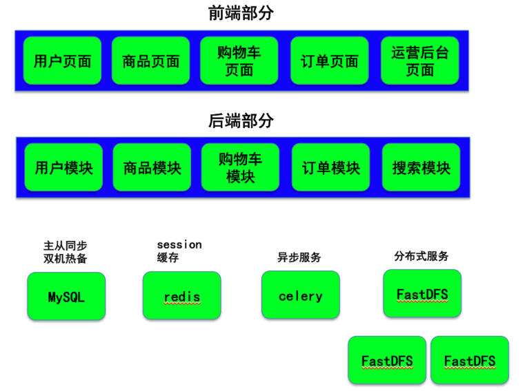

## 功能模块

### 用户模块

#### 注册
* 图片验证码
* 短信验证码
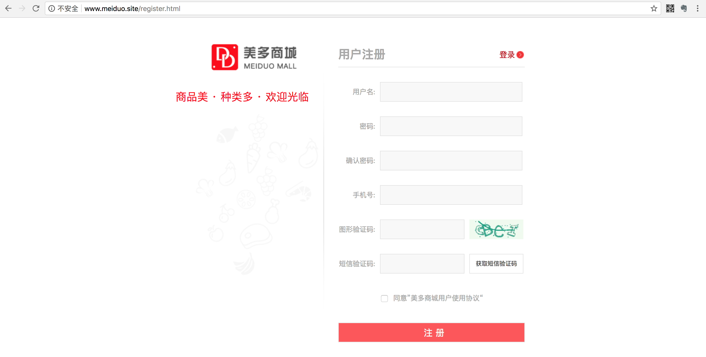
#### 登录
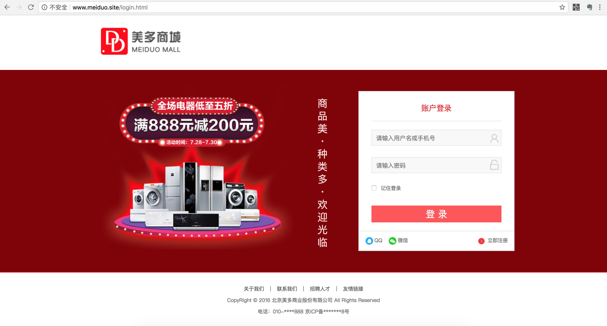

#### 第三方登录

#### 个人信息
* 邮箱填写验证
* 浏览历史记录
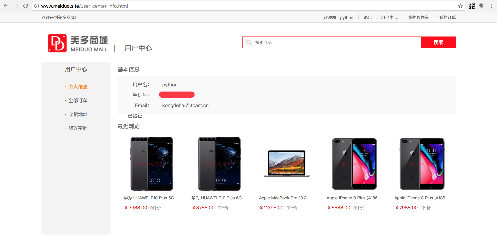
#### 地址管理
* 省市区地址信息加载
* 新增修改删除地址
* 设置默认地址

#### 修改密码
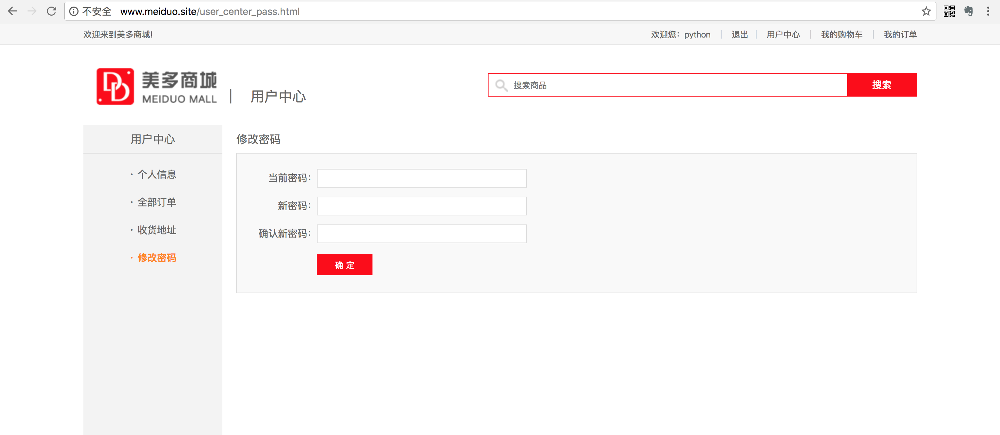

### 商品部分

#### 首页
* 商品分类
* 广告控制
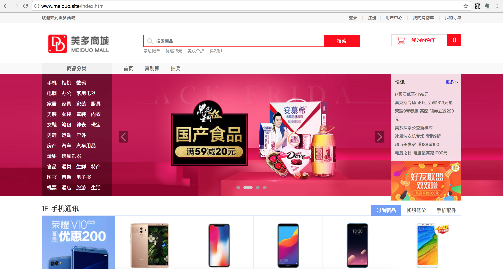

#### 商品列表
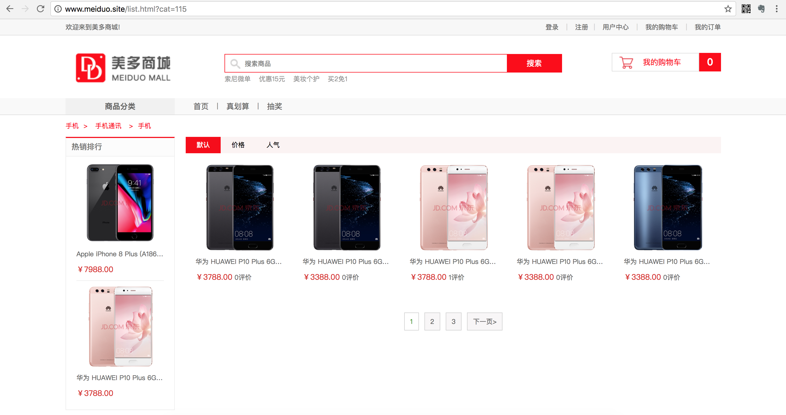
#### 商品详情
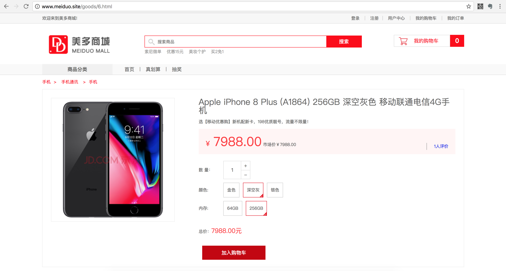
#### 商品搜索
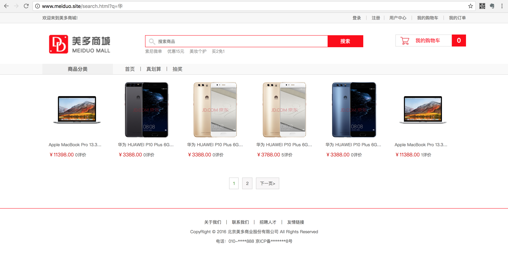
### 购物车部分
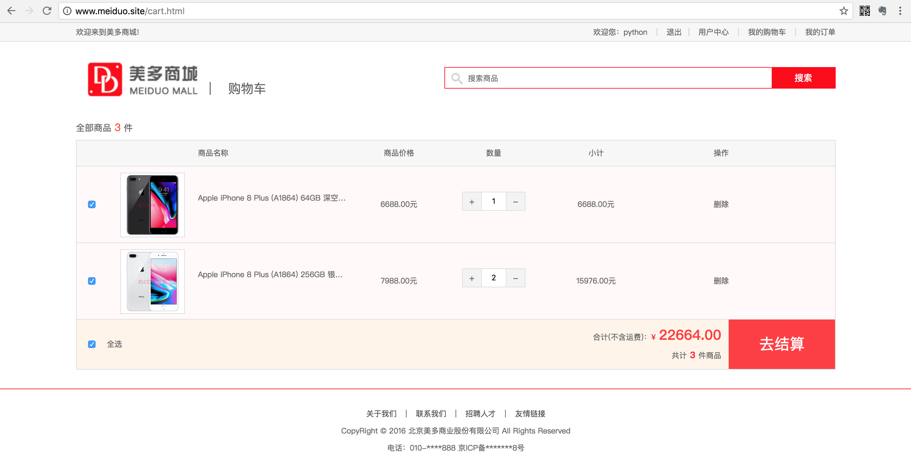
#### 购物车管理（增删改查）
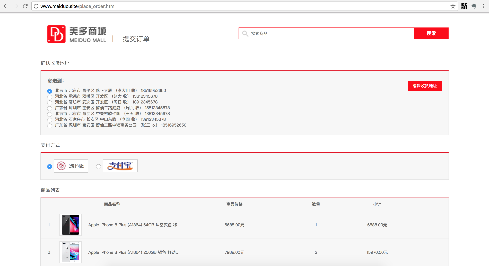
### 订单部分

#### 提交订单

#### 我的订单
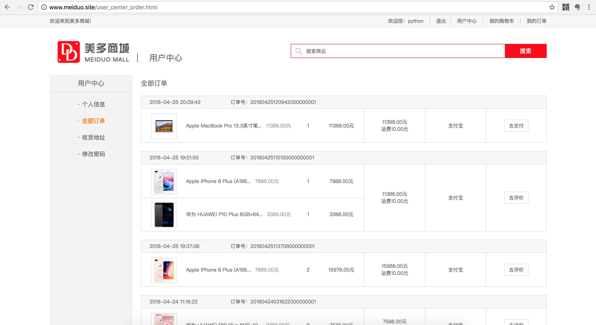
#### 订单评价
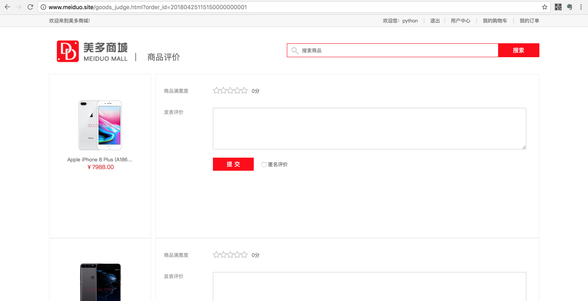
### 支付部分

#### 支付宝支付
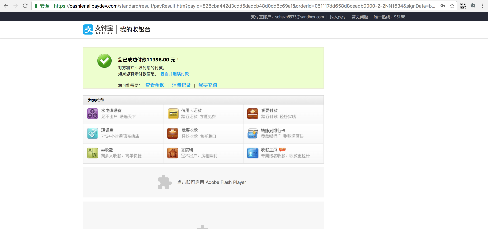